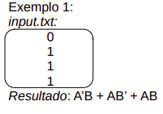
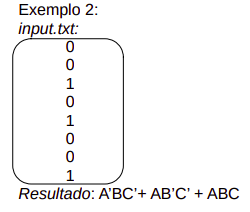

<h2 align="center">Expressão Booleana a partir de mintermos</h2>
<p align="center"> Um app CLI feito em Node.js, cujo o objetivo é ler um arquivo ".txt" que contém a saída de uma tabela verdade e retornar uma expressão booleana a partir de <a href="https://pt.wikipedia.org/wiki/Mintermo_e_Maxtermo">mintermos</a>.</p>

### Exemplos
<p></p>
<p></p>
	
### Rodando a aplicação
<p>Necessário ter <a href="https://nodejs.org/en/">Node.js</a></p>

```bash
# Clone este repositório
$ git clone <https://github.com/bcaua321/Expressao-Booleana-por-Mintermo>

# Acesse a pasta do projeto no terminal/cmd
$ cd Expressao-Booleana-por-Mintermo

# Instale as dependências
$ npm install

# Você pode criar uma pasta para os arquivos de input 
# Execute a aplicação
$ npm run app diretório_do_aquivo/file.txt
```

